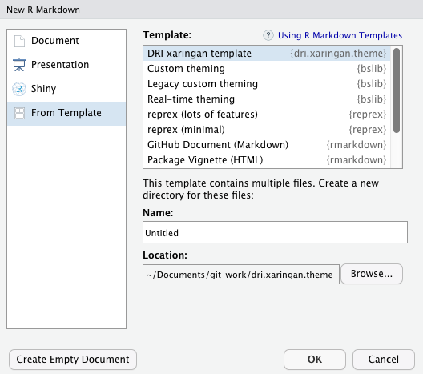

# DRI xaringan theme

An R package containing a [xaringan](https://github.com/yihui/xaringan) presentation theme and template in the style of the [Dementia Research Institute](https://ukdri.ac.uk/)

See a live example [here](https://h-mateus.github.io/presentations/example_dri_theme/index.html#1)

## Install

To install the package use the following:

```{r}
# install.packages("remotes")
remotes::install_github("H-Mateus/dri.xaringan.theme")
```

## Create a slideshow

To open the template in [RStudio](https://www.rstudio.com/), go to `File` > `New File` > `RMarkdown...` > `From Template` > `DRI xaringan template`



You can also use the `draft()` function from the `rmarkdown` package:

```{r}
rmarkdown::draft(
  file = "doc_name.Rmd",
  template = "dri-xaringan-theme",
  package = "dri.xaringan.theme"
)
```

## Contribute

I am not a web developer by any means, so I'm sure there's plenty of room for improvements!

Pull requests are very welcome, and please feel free to [leave an issue](https://github.com/H-Mateus/dri.xaringan.theme/issues).
